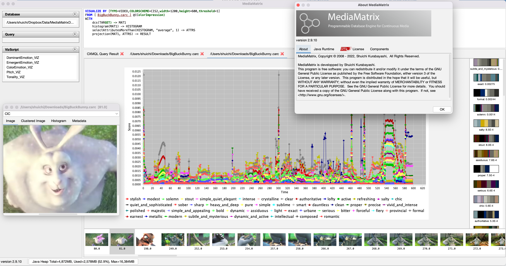

MediaMatrix
===========

A Programmable Database Engine for Multimedia

You can download the latest binary from [release](https://github.com/shuichi/MediaMatrix/releases "link to the release page") page.

## Papers

- Shuichi Kurabayashi and Yasushi Kiyoki, "Impression-Aware Video
  Stream Retrieval System with Temporal Color-Sentiment Analysis and
  Visualization," In Proceedings of the 23rd International Conference
  on Database and Expert Systems Applications (DEXA 2012), Vienna,
  Austria: Sep. 2012, pp. 168-182, https://doi.org/10.1007/978-3-642-32597-7_15.

- Shuichi Kurabayashi and Hiroki Hanaoka, "A large-scale visual
  check-in system for tv content-aware web with client-side video
  analysis offloading," in Proceedings of the 18th International
  Conference on Web Information Systems Engineering (WISE 2017),
  ser. Lecture Notes in Computer Science, vol. 10570, Moscow, Russia:
  Springer, Cham, Oct. 2017, pp. 159–174,
  https://doi.org/10.1007/978-3-319-68786-5_13.
